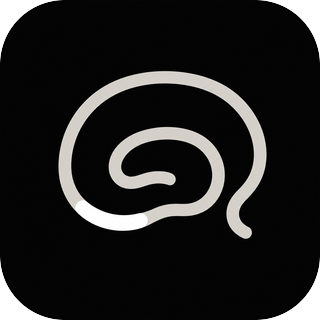

# CA3 Claude Code Plugin



CA3 gives AI agents a private, user-owned memory layer so important context can follow you across ChatGPT, Codex, Claude Code, and browser workflows.

This repository is a Claude Code plugin marketplace source for connecting Claude Code to the public CA3 OAuth MCP endpoint.

## Install

Add the CA3 marketplace, then install the `ca3` plugin at user scope:

```bash
claude plugin marketplace add enactflow/ca3-claude-code-plugin
claude plugin install ca3 --scope user
```

On first use, Claude Code should open the CA3 OAuth flow and ask you to authorize the requested scopes.

Start a new Claude Code session after installing so the CA3 skill and MCP server are loaded cleanly.

For project-level or local installs, replace `user` with `project` or `local`.

## Upgrade

Update the installed plugin at the same scope where it was installed:

```bash
claude plugin update ca3 --scope user
```

For project-level or local installs, replace `user` with `project` or `local`.

Restart Claude Code after upgrading. Existing sessions may keep older plugin skill or OAuth state.

## Verify

Confirm CA3 is installed and enabled:

```bash
claude plugin list --json
```

Look for `ca3` with version `0.3.0` or newer, the expected scope, and enabled state.

## MCP Endpoint

```text
https://ca3.dribwise.ai/mcp
```

## Plugin Layout

```text
.claude-plugin/marketplace.json
plugins/ca3/.claude-plugin/plugin.json
plugins/ca3/.mcp.json
plugins/ca3/skills/ca3/SKILL.md
```

## Usage

Use CA3 explicitly:

```text
Use CA3 to remember this project decision.
```

Or let Claude Code use CA3 automatically when project instructions say CA3 is the shared context surface.

CA3 behavior is defined by the live MCP tool descriptions exposed by:

```text
https://ca3.dribwise.ai/mcp
```

The plugin skill supplies trigger and workflow guidance without duplicating the
live schemas. The stable logical surface lets Claude Code catch up on current
work, recall prior material across CA3 memory surfaces, preserve durable
checkpoints, maintain confirmed personalization, and precisely work with Notes,
Collections, deletion, and attachments. Granted scopes control execution rather
than hiding tools from discovery.

For foundational context operations:

- `catch_up` for cross-session continuation and handoff.
- `recall` when earlier decisions, material, progress, or preferences may matter.
- `remember` for a durable cross-session checkpoint, not ordinary chat noise.
- `update_personalization` for stable, confirmed long-term facts or preferences.

New connections request CA3's current ten-scope default grant. Existing OAuth
grants are not expanded by a plugin upgrade. If a new context tool returns
`insufficient_scope`, reauthorize CA3 and retry in a new session.

For content writes, choose the smallest semantic operation:

- `create_note` for a new standalone artifact.
- `append_note` for chronological progress or handoff material.
- `edit_note` for exact, local corrections to an existing Note.

All three require a fresh `operation_id` and a short `profile_hint` describing
the durable user intent. Reuse the same operation ID only when retrying the same
request after a lost response.

Attachments are discovered through `get_note` and read through
`read_attachment`. Low-level upload sessions and signed policy mechanics are not
model-facing tools. If the live Note write schema does not expose a host file
input, report attachment writing as unsupported instead of inventing a transport
flow.

## Troubleshooting

After installing, upgrading, or re-authenticating the plugin, start a new Claude Code session before testing CA3.

If an old session reports an OAuth refresh or authentication error, authenticate CA3 again, confirm the CA3 MCP server is enabled, then open a new Claude Code session.

If an old session reports that it cannot find `SKILL.md` or that plugin skill paths do not match, treat it as stale Claude Code plugin cache state. The CA3 MCP tools may still work through tool discovery, but the stable fix is to open a new session after installation or update.

## License

MIT
